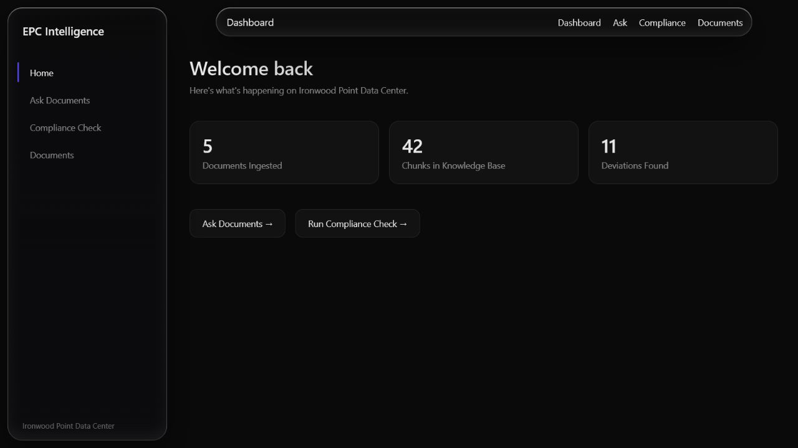
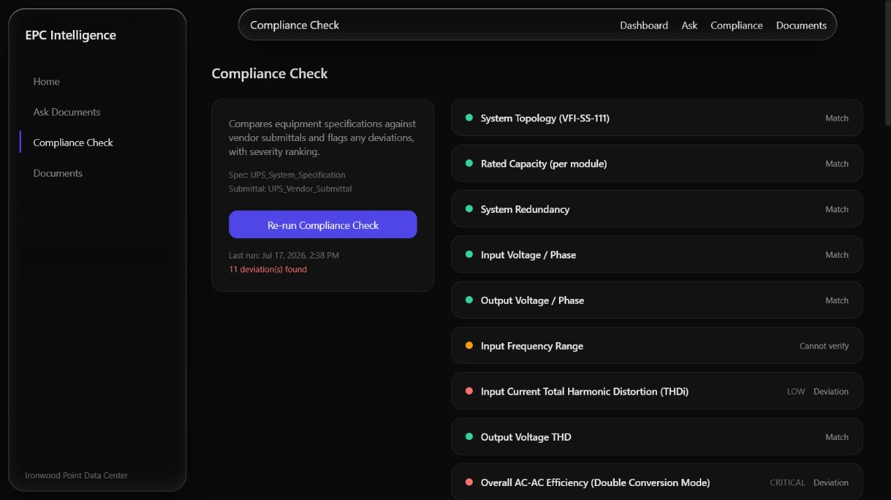
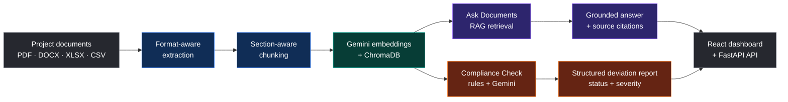

<div align="center">



<br />

[](./Dashboard)
[](./backend)
[](https://ai.google.dev/)
[](https://www.trychroma.com/)
[](https://epcmind.netlify.app/)

**Turn scattered project documents into a living intelligence layer.**

[Launch the live demo](https://epcmind.netlify.app/) · [Explore the product](#-product) · [See the architecture](#-architecture) · [Run locally](#-run-it-locally) · [API reference](#-api)

</div>

---
### Hosted demo

Try EPCmind at **[epcmind.netlify.app](https://epcmind.netlify.app/)**.

> **Render free-tier cold start:** The backend may take **1–2 minutes** to wake after a period of inactivity. If the first request is slow or briefly fails, wait a moment and retry—the server is restarting.


## The problem

A data-centre EPC team may need to reconcile thousands of equipment line items across specifications, vendor submittals, RFIs, schedules, and spreadsheets. The information exists—but it is fragmented, slow to compare, and expensive to miss.

> **A 40-page specification says 15 minutes. The vendor submits 10. EPCmind catches the gap before it reaches site.**

EPCmind is an AI intelligence platform for data-centre EPC delivery. It reads mixed project documents, answers questions with source citations, and compares vendor submissions against specifications requirement by requirement.

## ✦ Product

<table>
  <tr>
    <td width="50%" align="center">
      
      <br /><sub><b>Project intelligence at a glance</b> — live repository data</sub>
    </td>
    <td width="50%" align="center">
      
      <br /><sub><b>Requirement-level compliance</b> — ranked by status and severity</sub>
    </td>
  </tr>
</table>

### A real validated run

| Requirements compared | Match | Deviation | Cannot verify | Critical deviations |
|:---:|:---:|:---:|:---:|:---:|
| **41** | **17** | **11** | **13** | **6** |

```json
{
  "requirement": "Battery Backup / Autonomy",
  "specified_value": "15 minutes minimum at full rated load (500 kW)",
  "submitted_value": "10 minutes at full rated load (500 kW)",
  "status": "Deviation",
  "severity": "Critical"
}
```

## What EPCmind does

| Capability | What happens |
|---|---|
| **Ask Documents** | Ask natural-language questions across the project knowledge base and receive grounded answers with source citations. |
| **Compliance Check** | Compare every requirement in a specification against a vendor submittal and classify it as **Match**, **Deviation**, or **Cannot verify**. |
| **Severity Ranking** | Surface the deviations that deserve attention first: **Critical**, **Moderate**, or **Low**. |
| **Format-aware ingestion** | Extract paragraphs, headings, tables, and spreadsheet rows from PDF, DOCX, XLSX/XLS, CSV, TXT, and Markdown. |
| **Context-preserving retrieval** | Keep section hierarchy, document type, source name, and table structure attached to every indexed chunk. |
| **Project dashboard** | Track ingested documents, vector chunks, uploads, and saved compliance findings from one interface. |

## ✦ Architecture



### How a question becomes an answer

1. **Extract** — parsers preserve headings, tables, and spreadsheet-row structure.
2. **Chunk** — sections are split without losing their parent context or source metadata.
3. **Embed** — Gemini embeddings are stored in a persistent ChromaDB collection.
4. **Retrieve** — the query fetches the most relevant project chunks, optionally scoped by document type.
5. **Ground** — Gemini answers only from retrieved context and cites the source sections used.

### How a submittal becomes a decision

1. Read the equipment specification and vendor submittal.
2. Compare each stated requirement against the submitted value.
3. Return structured JSON: `Match`, `Deviation`, or `Cannot verify`.
4. Rank deviations by severity so engineers know where to look first.

## Tech stack

| Layer | Technology |
|---|---|
| Product UI | React, Vite, Tailwind CSS, GSAP |
| API | FastAPI, Python, Pydantic |
| LLM | Gemini 2.5 Flash via Google GenAI SDK |
| Embeddings | Gemini Embedding 001 |
| Vector store | ChromaDB, persisted locally |
| Extraction | `python-docx`, `pypdf`, `pandas` |

## ▶ Run it locally

### Prerequisites

- Python 3.10+
- Node.js 18+
- A [Gemini API key](https://aistudio.google.com/app/apikey)

### 1. Clone the project

```bash
git clone https://github.com/shubhamsaini-commits/EPCmind.git
cd EPCmind
```

### 2. Start the API

```bash
cd backend
python -m venv .venv
```

Activate the environment:

```bash
# macOS / Linux
source .venv/bin/activate

# Windows PowerShell
.venv\Scripts\Activate.ps1
```

Install dependencies and add your key:

```bash
pip install -r requirements.txt
```

Create `backend/.env`:

```env
API_KEY=your_gemini_api_key
```

Index the included sample project documents, then start FastAPI:

```bash
python ingest.py
uvicorn main:app --reload
```

The API is now available at `http://localhost:8000`; interactive docs are at `http://localhost:8000/docs`.

### 3. Start the dashboard

Open a second terminal:

```bash
cd Dashboard
npm install
npm run dev
```

The dashboard defaults to `http://localhost:8000` for the API. To override it, add `Dashboard/.env`:

```env
VITE_API_BASE=http://localhost:8000
```

### 4. Optional: run the landing experience

```bash
cd Landing
npm install
npm run dev -- --port 5174
```

### Hosted demo

Try EPCmind at **[epcmind.netlify.app](https://epcmind.netlify.app/)**.

> **Render free-tier cold start:** The backend may take **1–2 minutes** to wake after a period of inactivity. If the first request is slow or briefly fails, wait a moment and retry—the server is restarting.

## 90-second demo path

1. Open **Dashboard** and show the indexed-document and deviation counters.
2. Open **Ask Documents** and ask: `What battery-backup autonomy does the UPS specification require?`
3. Show the grounded response and its source citation.
4. Open **Compliance Check** and run the UPS specification against the vendor submittal.
5. Reveal the critical gap: **15 minutes specified → 10 minutes submitted**.

## ↗ API

| Method | Endpoint | Purpose |
|---|---|---|
| `GET` | `/` | Service status |
| `POST` | `/ask` | Ask a grounded question; optionally filter by document type |
| `POST` | `/upload` | Upload and index a supported project document |
| `GET` | `/documents` | List indexed documents |
| `POST` | `/compliance-check` | Run the specification/submittal comparison |
| `GET` | `/compliance-check` | Retrieve the most recently saved comparison |
| `GET` | `/stats` | Return dashboard totals |

Example question:

```bash
curl -X POST http://localhost:8000/ask \
  -H "Content-Type: application/json" \
  -d '{"question":"What backup duration is required?","document_type":"Specification"}'
```

## Repository map

```text
EPCmind/
├── Dashboard/                 # Main React product interface
│   └── src/
│       ├── components/        # Navigation, layout, upload UI
│       ├── pages/             # Dashboard, Ask, Compliance, Documents
│       └── services/          # FastAPI client
├── Landing/                   # Animated product story / landing experience
├── backend/
│   ├── Sample_docs/           # UPS spec, submittal, RFI, schedule samples
│   ├── chroma_db/             # Persistent vector collection
│   ├── main.py                # FastAPI endpoints
│   ├── exctractors.py         # PDF, DOCX, text, and spreadsheet extraction
│   ├── chunker.py             # Section- and table-aware chunking
│   ├── vector_store.py        # Embeddings, retrieval, metadata filters
│   ├── rag.py                 # Grounded Q&A orchestration
│   ├── compilance.py          # Structured comparison engine
│   └── ingest.py              # Sample-document indexing
└── assets/                    # README visuals
```

## Why it is different

- **Not just chat:** EPCmind combines RAG with a structured, requirement-level compliance engine.
- **Not blind text splitting:** headings, parent sections, tables, and spreadsheet rows survive ingestion.
- **Not an opaque answer:** Q&A returns source citations; compliance returns auditable values and labels.
- **Not a toy dataset:** the repository ships with a multi-format sample EPC document set and saved comparison output.

## Roadmap

- [ ] OCR for scanned documents and engineering drawings
- [ ] Rich EPC metadata: vendor, revision, discipline, package, and specification section
- [ ] Multi-package and multi-vendor compliance runs
- [ ] Reviewer workflows: comments, overrides, and approval history
- [ ] Procurement + schedule risk signals across the complete project corpus

## Security notes

- Keep `API_KEY` in `.env`; never commit it.
- Restrict CORS origins and add authentication before exposing the API outside a trusted development environment.
- Review AI-generated compliance findings against the cited source documents before making contractual or procurement decisions.

## Contributing

Issues and pull requests are welcome. If you are extending extraction or compliance logic, include a small representative document and a reproducible expected result.

<div align="center">

### Built to catch the gap before it becomes rework.

[⭐ Star EPCmind](https://github.com/shubhamsaini-commits/EPCmind) · [Open an issue](https://github.com/shubhamsaini-commits/EPCmind/issues)

</div>
